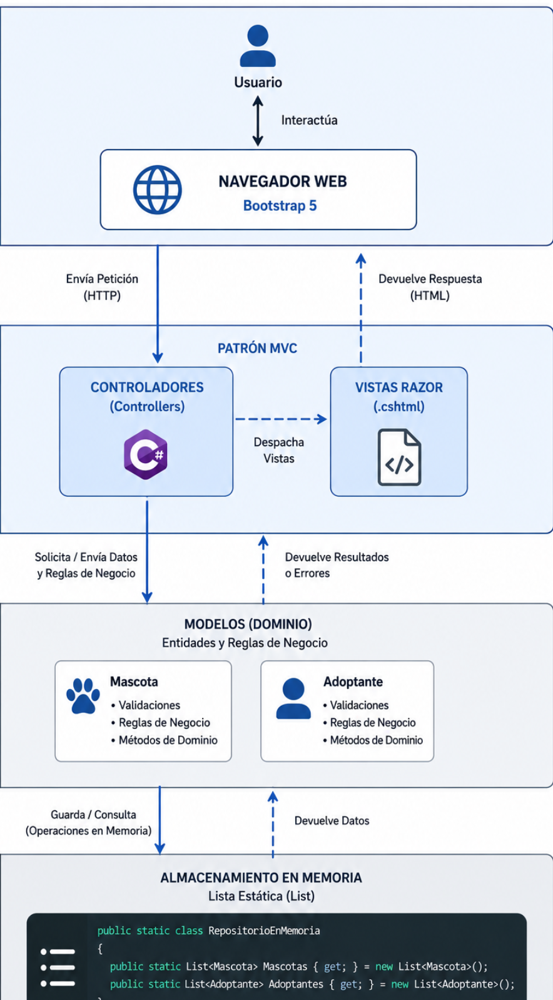

# ADR-01: [Título corto de la decisión]

| Campo  | Valor |
|--------|-------|
| Autor  | [Armanndo Cen] |
| Fecha  | 15/05/2026 |
| Estado | `Propuesto` · `Aceptado` · `Rechazado` · `Reemplazado por ADR-NN` |

---

## Contexto

Este cuatrimestre estaré desarrollando PetConnect, la cual sería una plataforma web que iría dirigida a los refugios pequeños de animales para que dejen de usar libretas o Excel y puedan gestionar sus rescates, tales como: historiales médicos y adopciones, lo haría dirigido a los que administran los refugios y a las personas interesadas en adoptar de forma rápida
Como restricciones, tengo el tiempo limitado del cuatrimestre y la necesidad de usar tecnologías que ya conozco para no perder tiempo configurando entornos complejos desde cero.

---

## Decisión

Por la informacion que recopile y entendi decidí usar un Estilo Arquitectónico en Capas combinado con el patrón MVC de ASP.NET con C#. Para el diseño visual usaré Bootstrap 5, y en almacenamiento de datos lo hare temporal en memoria mediante listas estáticas, ya que es algo que se hacerca a el comportamiento de una base de datos real mientras avanzamos en el cuatri

### ¿Por qué?

Por el orden en el código ya que de eso se basa la materia, entonces separar las vistas de la lógica de negocio hace que el sistema sea limpio, por ejemplo si cambio un formulario, no rompo el funcionamiento de algo interno

Tambien para el control de estados MVC me facilita manejar si una mascota está Rescatada o Adoptada a través de los controladores

y me ayudara a agilizar y ser rapido cuando use C# y Visual Studio, avanzo mucho más rápido porque ya conozco la herramienta.
### Alternativas consideradas

*(Mínimo 3 filas)*

| Alternativa   | Por qué la descarté |
|-------------  |---------------------|
| Microservicios| Vi que es demasiado compleja y resultara pesada para un sistema de refugio local               |
| React y Node.js           | A pesar de que ya ando viendo un poco de esto en otra materia aun no tengo el conocimiento necesario ya que equiere mantener dos proyectos separados (Frontend y Backend) y me duplicaria el trabajo.                 |
| PHP Nativo           | Me resultaria rápido, pero el código queda desorganizado y es casi de lo mas importante ademas es difícil de mantener a largo plazo.                 |

---

## Consecuencias

**✅ Lo que gano:**

Menciona al menos:
Técnico: El mantenimiento es sencillo ya que puedo cambiar el diseño visual sin tocar las reglas de negocio del software.

Equipo/Proceso: Permite dividir tareas fácilmente,pueden dividirse y uno puede enfocarse en el diseño de las pantallas y otro en la lógica en C#.

**⚠️ Lo que sacrifico o asumo:**

Menciona al menos:
- Limitación técnica: Al momento de procesar todo en el servidor, consumirá más recursos que una API moderna si el sitio llega a saturarse.

Deuda o riesgo: En mi caso como los datos están en memoria, todo se borra al reiniciar la app, es algo A lo que le tendre que dar mucha importancia y que tendré que solucionar más adelante conectando una base de datos

## Diagrama

Un boceto de cómo se estructura tu sistema (draw.io, Mermaid o a mano escaneado)

