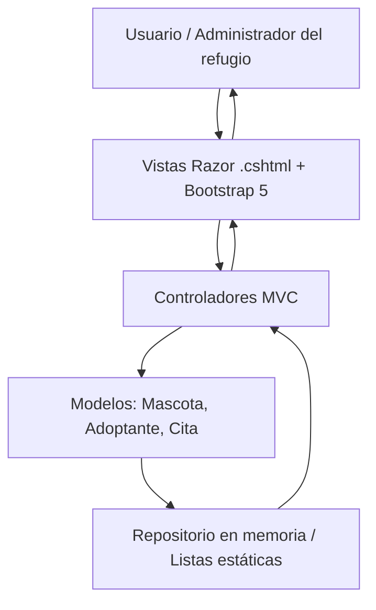
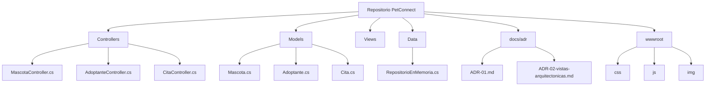
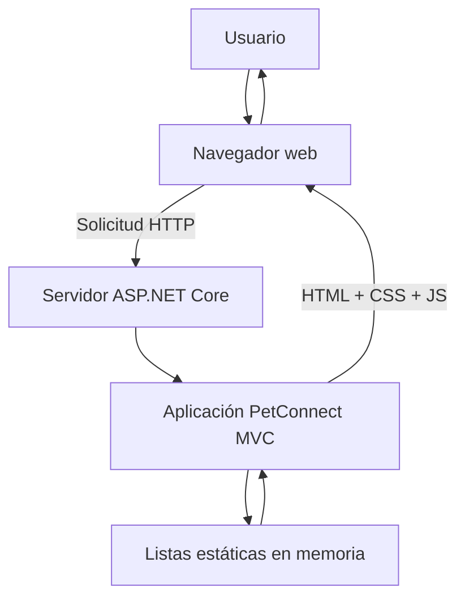
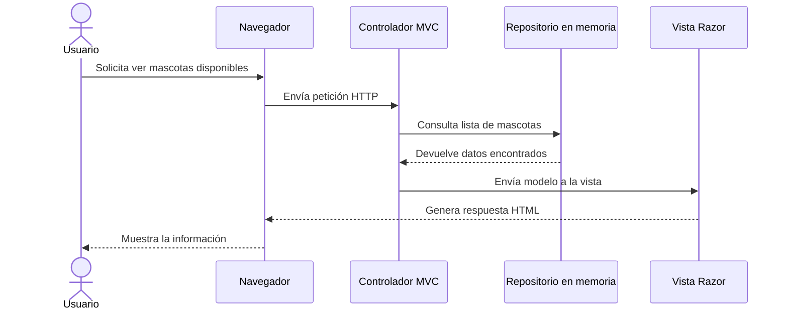

# ADR-02: Definición de vistas arquitectónicas para PetConnect

| Campo  | Valor                   |
| ------ | ----------------------- |
| Autor  | Jesús Armando Cen Balam |
| Fecha  | 05/06/2026              |
| Estado | Aceptado                |

---

## Contexto

PetConnect es una plataforma web desarrollada para apoyar a refugios pequeños de animales en la gestión de mascotas rescatadas, adoptantes, historiales médicos y procesos de adopción.

En el ADR-01 se decidió utilizar un estilo arquitectónico en capas combinado con el patrón MVC de ASP.NET Core, usando C#, Bootstrap 5 y almacenamiento temporal en memoria mediante listas estáticas. Esta decisión permitió mantener separado el diseño visual, la lógica del sistema y los datos.

Ahora, como avance del proyecto, es necesario documentar el sistema desde diferentes vistas arquitectónicas para comprender mejor cómo está organizado, cómo se ejecuta, cómo se despliega y cómo interactúan sus procesos principales.

---

## Decisión

Decidí documentar la arquitectura de PetConnect mediante cuatro vistas arquitectónicas:

1. Vista lógica
2. Vista física
3. Vista de despliegue
4. Vista de procesos

Estas vistas serán representadas mediante diagramas en Mermaid dentro del repositorio, ya que Mermaid permite documentar los diagramas directamente en archivos Markdown y facilita que los cambios queden versionados en GitHub.

---

## ¿Por qué?

La decisión se tomó porque el proyecto ya cuenta con una estructura MVC definida y necesita una documentación más clara para explicar cómo se relacionan sus partes principales.

La vista lógica muestra la organización interna del sistema, separando la interacción del usuario, las vistas, los controladores, los modelos y el almacenamiento temporal.

La vista física muestra las carpetas y archivos reales que forman parte del repositorio.

La vista de despliegue explica cómo el usuario accede al sistema desde el navegador y cómo la aplicación responde desde ASP.NET Core.

La vista de procesos representa el flujo principal cuando un usuario consulta información dentro del sistema, por ejemplo una lista de mascotas disponibles.

---

## Alternativas consideradas

| Alternativa                           | Por qué la descarté                                                                                                       |
| ------------------------------------- | ------------------------------------------------------------------------------------------------------------------------- |
| Usar solo un diagrama general         | No muestra con suficiente claridad las diferentes partes del sistema ni cumple con las cuatro vistas solicitadas.         |
| Hacer los diagramas como imágenes PNG | Las imágenes son más difíciles de modificar y no reflejan tan bien el historial de cambios en GitHub.                     |
| Usar draw.io                          | Es una buena opción, pero Mermaid se integra mejor con Markdown y permite documentar todo directamente en el repositorio. |
| No documentar vistas arquitectónicas  | Haría más difícil explicar la arquitectura del proyecto y justificar las decisiones técnicas tomadas.                     |

---

## Consecuencias

### Lo que gano

**Consecuencia técnica:**
El sistema queda mejor documentado porque se puede entender desde diferentes perspectivas: estructura interna, organización de archivos, despliegue y comportamiento de procesos.

**Consecuencia sobre el proceso:**
Facilita continuar el desarrollo porque cada cambio futuro puede relacionarse con una parte específica de la arquitectura.

**Mantenimiento:**
Los diagramas en Mermaid pueden actualizarse directamente desde el repositorio sin depender de archivos externos.

---

### Lo que sacrifico o asumo

**Limitación técnica:**
Los diagramas representan el estado actual del sistema, pero deberán actualizarse si más adelante se agrega una base de datos real, autenticación o una API.

**Deuda o riesgo:**
Si el proyecto crece y los diagramas no se actualizan junto con el código, la documentación puede quedar desfasada.

**Complejidad adicional:**
Aunque el sistema todavía es pequeño, mantener documentación arquitectónica requiere tiempo y orden.

---

# Diagramas arquitectónicos

## 1. Vista lógica

---

## 2. Vista física

---

## 3. Vista de despliegue

---

## 4. Vista de procesos

---

## Declaración de uso de IA

Para la elaboración de este ADR se utilizó apoyo de inteligencia artificial como herramienta de asistencia para organizar ideas, mejorar la redacción y estructurar los diagramas en formato Mermaid. La decisión arquitectónica, el contexto del proyecto y la aplicación al sistema PetConnect fueron revisados y adaptados por el autor.
